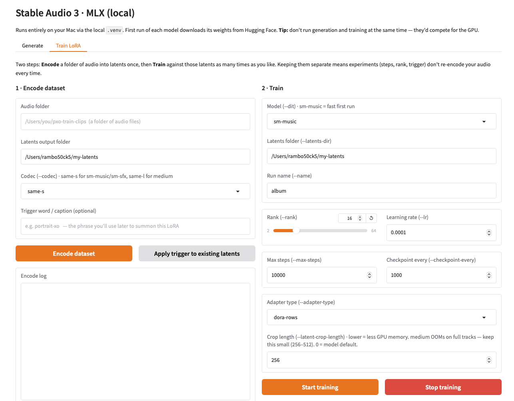

# sa3-mlx-ui

A small local **Gradio UI for the Stable Audio 3 MLX build** — generate audio
and **train LoRAs on Apple Silicon**, from a browser tab, without the terminal.

> **Unofficial community tool.** This is a thin wrapper I built around
> Stability AI's `stable-audio-3` `optimized/mlx` runtime. It is not affiliated
> with or endorsed by Stability AI. It ships no model code and no weights — it
> just drives the scripts already in your local SA3 install.




## What it does

- **Generate tab** — text-to-audio, audio-to-audio, and inpainting, with CFG /
  negative-prompt / APG controls and optional **LoRA loading** (with a strength
  slider).
- **Train LoRA tab** — a two-step workflow:
  1. **Encode** a folder of audio into latents (once).
  2. **Train** a LoRA against those latents (as many times as you like), with a
     live status readout, a **Stop** button, an adjustable **crop length** (to
     keep memory in check on `medium`), an optional **trigger word**, and a
     checkpoint list you can send straight to the Generate tab to audition.

Everything runs locally on your Mac via the SA3 `.venv`. Nothing is uploaded.

## Prerequisites

You need a working **Stable Audio 3 MLX** install first (Apple Silicon Mac):

- Stability AI's `stable-audio-3` repo, with the `optimized/mlx` folder set up
  via its own `./install.sh` (this creates the `.venv` and fetches weights on
  first use). Follow that project's README for setup.
- This UI assumes the standard layout: `stable-audio-3/optimized/mlx/` with the
  `scripts/` folder (`sa3_mlx.py`, `pre_encode_mlx.py`, `lora_train_mlx.py`) and
  the local `.venv` next to it.

## Install

Drop the UI file into your SA3 MLX folder and install Gradio into its venv:

```bash
# from this repo
cp sa3_mlx_ui.py ~/stable-audio-3/optimized/mlx/
cp sa3-ui.command ~/stable-audio-3/optimized/mlx/   # optional double-click launcher
cd ~/stable-audio-3/optimized/mlx
uv pip install gradio     # one-time, into the SA3 .venv
```

(If your `stable-audio-3` lives elsewhere, adjust the paths, and edit `MLX_DIR`
at the top of `sa3-ui.command`.)

## Run

```bash
cd ~/stable-audio-3/optimized/mlx
./.venv/bin/python sa3_mlx_ui.py
```

Then open http://127.0.0.1:7860. On macOS you can instead `chmod +x
sa3-ui.command` and double-click it.

## Notes & gotchas

- **Don't generate and train at the same time** — both use the GPU and will
  compete for Metal resources (you may see a "Failed to create Metal shared
  event" error). Run one at a time, and quit other GPU-heavy apps while
  training.
- **Match the model to its codec/latents.** `sm-music`/`sm-sfx` pair with the
  `same-s` codec; `medium` pairs with `same-l`. Latents encoded for one won't
  train the other. Encode into a separate folder per model.
- **`medium` is memory-hungry.** Training on full-length latents can exhaust GPU
  memory even on large Macs. The **crop length** control defaults to a small
  value for this reason; raise it only if training is stable.
- **Trigger word.** With no `--prompt-config`, the SA3 trainer falls back to a
  legacy prompt path that reads a `text` field from each latent's `.json`
  sidecar. The "trigger" field writes your phrase there so every clip trains
  against it — your handle for summoning the style at generation time. This
  depends on the trainer's current behavior; verify by training a short run and
  checking the trigger word actually steers generation.
- **Steps.** ~10k is a common target for a LoRA; the best checkpoint is often
  not the final one, so audition earlier checkpoints too.

## Requirements

- macOS on Apple Silicon
- A working `stable-audio-3` `optimized/mlx` install (with its `.venv`)
- `gradio` (see `requirements.txt`)

## Licensing & weights

- **This UI code** is MIT-licensed (see `LICENSE`).
- **Stable Audio 3, its `optimized/mlx` runtime, and its model weights are
  NOT covered by that license.** They belong to Stability AI and are governed
  by the **Stability AI Community License** and the model's own terms, which
  include a commercial-use revenue threshold. This repo redistributes none of
  those weights or that code — you obtain them yourself through the official
  SA3 install, and by doing so you accept Stability's license. Review Stability
  AI's current terms before any commercial use; I'm not a lawyer and nothing
  here is legal advice.

## Acknowledgments

This UI stands entirely on other people's work:

- **Stability AI** — Stable Audio 3 and the `optimized/mlx` runtime this UI
  wraps.
- **Dada Bots — Underfit** — the LoRA training conventions the MLX trainer
  mirrors.
- **@betweentwomidnights** — the MLX LoRA-training path for Apple Silicon.

If you build on this, please keep these credits.

— Portrait XO
