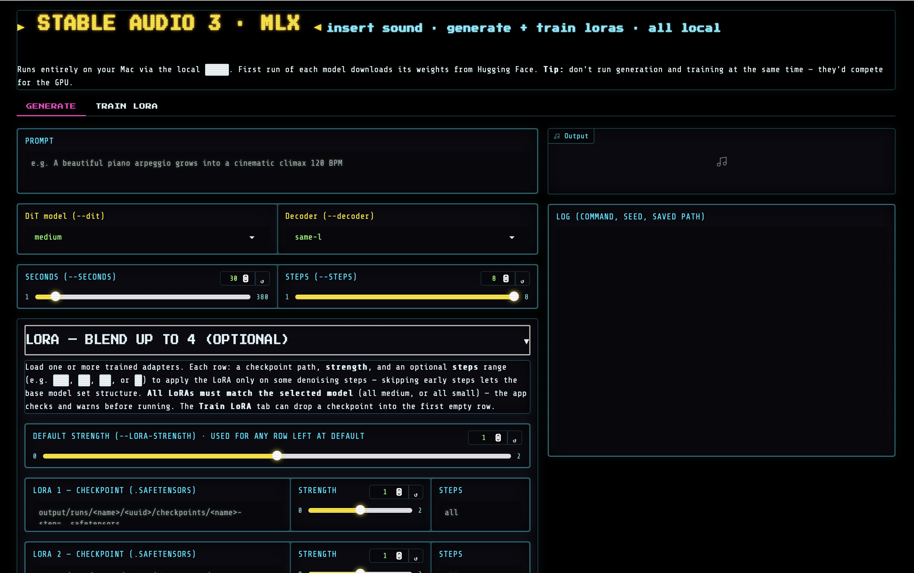
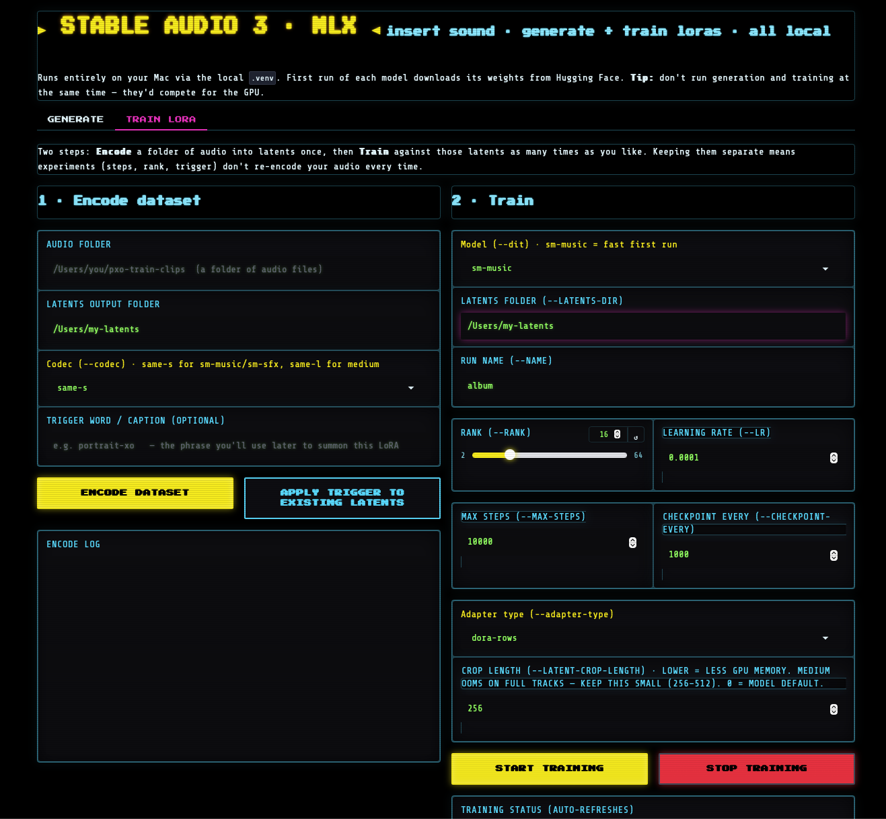

# sa3-mlx-ui

A small local **Gradio UI for the Stable Audio 3 MLX build** — generate audio
and **train LoRAs on Apple Silicon**, from a browser tab, without the terminal.

> **Unofficial community tool.** This is a thin wrapper I built around
> Stability AI's `stable-audio-3` `optimized/mlx` runtime. It is not affiliated
> with or endorsed by Stability AI. It ships no model code and no weights — it
> just drives the scripts already in your local SA3 install.





## What's new

**Blend up to 4 LoRAs at once.** The Generate tab's LoRA panel is now four rows
instead of one. Each row takes a checkpoint, its own **strength**, and an
optional **steps** range, so you can stack a texture LoRA over a rhythm LoRA,
dial each one in separately, and let the base model keep control of the parts
you don't want overwritten. The app also checks every checkpoint's recorded base
model before it runs and tells you if one doesn't match the selected DiT —
instead of letting the CLI fail with a shape error partway through.

## What it does

- **Generate tab** — text-to-audio, audio-to-audio, and inpainting, with CFG /
  negative-prompt / APG controls and **multi-LoRA loading** — blend up to **4**
  adapters at once, each with its own strength and step range (see
  [Blending LoRAs](#blending-loras)).
- **Train LoRA tab** — a two-step workflow:
  1. **Encode** a folder of audio into latents (once).
  2. **Train** a LoRA against those latents (as many times as you like), with a
     live status readout, a **Stop** button, an adjustable **crop length** (to
     keep memory in check on `medium`), an optional **trigger word**, and a
     checkpoint list you can send straight to the Generate tab to audition.

Everything runs locally on your Mac via the SA3 `.venv`. Nothing is uploaded.

## Prerequisites

- An **Apple Silicon Mac** (M1 or newer). MLX is Metal-backed — Intel Macs can't
  run this.
- **~9 GB of free disk space** for the Stable Audio 3 weights (more if you
  download several DiT bundles), plus room for your latents and checkpoints.
- **Apple's Command Line Tools**, which is where `git` comes from. If
  `git --version` errors out, run `xcode-select --install` and let it finish
  before going on.
- A working **Stable Audio 3 MLX** install — step 1 below sets that up. This UI
  ships no model code and no weights. It drives the scripts already in your SA3
  install (`sa3_mlx.py`, `pre_encode_mlx.py`, `lora_train_mlx.py`) using the
  `.venv` sitting next to them, so it assumes the standard
  `stable-audio-3/optimized/mlx/` layout.

## Install

Three copy-paste blocks. Every path is absolute (`~/…`), so it doesn't matter
which folder your Terminal happens to be in.

**1 — Install Stable Audio 3 for Mac** (skip if you already have it):

```bash
cd ~ && git clone https://github.com/Stability-AI/stable-audio-3
cd ~/stable-audio-3/optimized/mlx && ./install.sh
```

The installer sets up `uv`, creates the `.venv`, and asks which model bundles to
download. Pick at least one — `sm-music` is the fast one, `medium` is the
higher-quality one.

**2 — Download this UI and copy it into that folder:**

```bash
cd ~ && git clone https://github.com/portraitxo/Stable-Audio-3-UI-LoRA-Training-for-MAC sa3-mlx-ui
cp ~/sa3-mlx-ui/sa3_mlx_ui.py ~/sa3-mlx-ui/sa3-ui.command ~/stable-audio-3/optimized/mlx/
chmod +x ~/stable-audio-3/optimized/mlx/sa3-ui.command
```

**3 — Install Gradio into the SA3 venv:**

```bash
~/stable-audio-3/optimized/mlx/.venv/bin/python -m pip install gradio
```

Use the `.venv`'s own `pip`, as above — not `uv pip install`. SA3's installer
only puts `uv` on your PATH for the length of its own run, so in a fresh
Terminal window `uv` is usually `command not found`.

(If your `stable-audio-3` lives somewhere other than `~/stable-audio-3`, adjust
these paths and edit `MLX_DIR` at the top of `sa3-ui.command`.)

## Run

```bash
cd ~/stable-audio-3/optimized/mlx && ./.venv/bin/python sa3_mlx_ui.py
```

Then open http://127.0.0.1:7860. Or just double-click `sa3-ui.command` in
Finder — it does the same thing and opens the browser for you.

Port 7860 is the Gradio default, so other audio UIs tend to want it too. If it's
already taken, Gradio moves to the next free port (7861, 7862…) — read the URL
printed in the Terminal rather than assuming 7860.

## Troubleshooting

| What you see | What to do |
| --- | --- |
| `cp: sa3_mlx_ui.py: No such file or directory` | The `git clone` in step 2 was skipped, so there's nothing to copy. Run that whole block. |
| `git: command not found`, or a popup about developer tools | `xcode-select --install`, wait for it to finish, then start at step 1. |
| `uv: command not found` | Normal in a new Terminal window. Install Gradio with the `.venv` pip from step 3 instead. |
| `No virtual environment at …/.venv/bin/python` | SA3's own `./install.sh` hasn't been run yet — do step 1. |
| `ModuleNotFoundError: No module named 'gradio'` | Step 3 didn't run, or it went into a different Python. Re-run it with the full `~/stable-audio-3/optimized/mlx/.venv/bin/python` path. |
| `permission denied: ./sa3-ui.command`, or double-clicking it does nothing | `chmod +x ~/stable-audio-3/optimized/mlx/sa3-ui.command` |
| `Could not find: …/stable-audio-3/optimized/mlx` (from the launcher) | Your SA3 install is somewhere else — edit `MLX_DIR` at the top of `sa3-ui.command`. |
| `address already in use` | Another app has port 7860. Quit it, or use whichever 786x URL the Terminal prints. |
| `Failed to create Metal shared event` | You're generating and training at the same time. Run one at a time. |
| Model weights download every time / fills the disk | Weights land in the HuggingFace cache and are symlinked into `models/mlx/`. Don't delete that cache between runs. |

## Blending LoRAs

The **LoRA — blend up to 4** accordion on the Generate tab has four identical
rows. Fill in as many as you want and leave the rest empty:

| Field | What it does |
| --- | --- |
| **checkpoint** | Path to a `.safetensors` LoRA. The **Train LoRA** tab's "use checkpoint" button drops one into the first empty row. |
| **strength** | How hard that adapter pulls (0–2). Lower it when a LoRA is overpowering the others or sounds too much like its training data. |
| **steps** | Which denoising steps the LoRA applies on — `2-8`, `2-`, `-4`, or a single `3`. Empty means all steps. |

The **Default strength** slider above the rows sets `--lora-strength` for the
run; per-row strengths override it.

The **steps** range is the useful lever when you stack adapters. Skipping the
early steps (e.g. `3-`) lets the base model lay down structure and form before
the LoRA colors it in — often the difference between a blend that sounds musical
and one that collapses into training-data mush. Conversely, `-4` applies a LoRA
only while the broad shape is being decided and leaves the detail alone.

**All loaded LoRAs must be trained on the same base model as the one you're
generating with** — you can't mix a `medium` LoRA with a small model, or vice
versa. The UI reads each checkpoint's metadata and stops with an explanation
before launching, so a mismatch costs you a message instead of a crash.

## Notes & gotchas

- **Don't generate and train at the same time** — both use the GPU and will
  compete for Metal resources (you may see a "Failed to create Metal shared
  event" error). Run one at a time, and quit other GPU-heavy apps while
  training.
- **Match the model to its codec/latents.** `sm-music`/`sm-sfx` pair with the
  `same-s` codec; `medium` pairs with `same-l`. Latents encoded for one won't
  train the other. Encode into a separate folder per model.
- **LoRAs can't cross model families.** Every LoRA loaded in one generation
  must match the selected DiT's base (all `medium`, or all small). The UI checks
  this for you before running.
- **`medium` is memory-hungry.** Training on full-length latents can exhaust GPU
  memory even on large Macs. The **crop length** control defaults to a small
  value for this reason; raise it only if training is stable.
- **Trigger word.** With no `--prompt-config`, the SA3 trainer falls back to a
  legacy prompt path that reads a `text` field from each latent's `.json`
  sidecar. The "trigger" field writes your phrase there so every clip trains
  against it — your handle for summoning the style at generation time. This
  depends on the trainer's current behavior; verify by training a short run and
  checking the trigger word actually steers generation.
- **Steps.** ~10k is a common target for a LoRA; the best checkpoint is often
  not the final one, so audition earlier checkpoints too.

## Requirements

- macOS on Apple Silicon
- A working `stable-audio-3` `optimized/mlx` install (with its `.venv`)
- `gradio` (see `requirements.txt`)

## Licensing & weights

- **This UI code** is MIT-licensed (see `LICENSE`).
- **Stable Audio 3, its `optimized/mlx` runtime, and its model weights are
  NOT covered by that license.** They belong to Stability AI and are governed
  by the **Stability AI Community License** and the model's own terms, which
  include a commercial-use revenue threshold. This repo redistributes none of
  those weights or that code — you obtain them yourself through the official
  SA3 install, and by doing so you accept Stability's license. Review Stability
  AI's current terms before any commercial use; I'm not a lawyer and nothing
  here is legal advice.

## Acknowledgments

This UI stands entirely on other people's work:

- **Stability AI** — Stable Audio 3 and the `optimized/mlx` runtime this UI
  wraps.
- **Dada Bots — Underfit** — the LoRA training conventions the MLX trainer
  mirrors.
- **@betweentwomidnights** — the MLX LoRA-training path for Apple Silicon.

If you build on this, please keep these credits.

— Portrait XO
